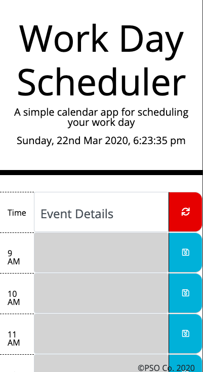

Day planner
<ul>
<li>user enter event details into the desired timeslot</li>
<li>To save details onto localstorage, click save button</li>
<li>user is alerted if save button is clicked but no details enetered</li>
<li>To remove details and refresh the app, click on refresh button</li>
</ul>
